Hello world! 👋

🥷 I'm a cloud architect, platform builder, Linux guy and consultant working on Azure.

🔨 I enjoy designing and building cloud-ready architectures, helping platform and developer teams with adoption of cloud and automating everything along the way.

☁️ My consultancy work is mostly based around cloud transformation and architecture, Cloud Adoption Framework, Infrastructure as Code, PowerShell, GitHub, DevOps practices and architecture in general (network, security, identity, governance +++). You can see my professional certifications [here](https://www.credly.com/users/matsest).

💡 Besides work tasks I enjoy learning other cloud native and open source tech, solving programming challenges (preferably with Go/Python) and contributing to open source projects when I can. When I'm not at the computer I enjoy going to [concerts](https://github.com/matsest/lastfm-artists-seen-live/blob/main/artists.md) and [listen to music](https://www.last.fm/user/matsest), organizing [music quizzes](https://quiz.mxe.no), and enjoying life – all while looking out for new things to learn and interesting people to meet.

👉‍ Learn more and find me online at [my personal website](https://mxe.no).

