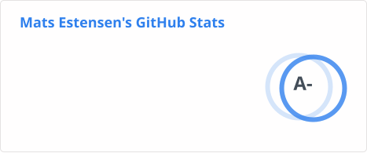
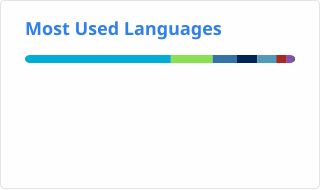

Hello world! 👋

🥷 I'm a cloud architect, platform builder and open source contributor.

🔨 I have 10+ years professional experience with architecting and building cloud-based solutions, enabling platform and developer teams and automating everything along the way.

☁️ My consultancy work is mostly based around cloud transformation and architecture, Infrastructure as Code, PowerShell, GitHub, DevOps practices and architecture in general (network, security, identity, governance +++). I'm working primarily on Azure, but I'm also familiar with other cloud providers as well (AWS/GCP), as well as on-premises platforms. Experience from large-scale Norwegian enterprises, including regulated industries.

💡 In my time outside of work I enjoy tinkering with open source, working on self-hosting (no cloud, huh!), solving programming challenges (preferably with Go/Python) and contributing to open source projects on GitHub. When I'm not at the computer I enjoy going to [concerts](https://github.com/matsest/lastfm-artists-seen-live/blob/main/artists.md), [listen to music](https://www.last.fm/user/matsest), organizing [music quizzes](https://quiz.mxe.no), going to [football matches](https://godset.mats.codes) and enjoying life – all while looking out for new things to learn and interesting people to meet.

👉‍ Learn more and find me online at [my personal website](https://www.mxe.no).

